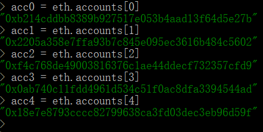
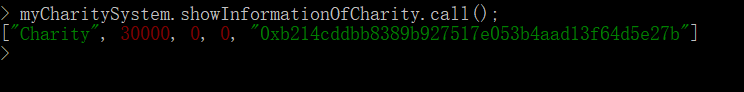

# CharitySystem
## 慈善机构管理系统


> github地址: https://github.com/NeoBryant/CharitySystem


## 项目结构
```
├─assets               //报告插图
├─contract            
|  └─CharitySystem.sol   //智能合约代码
└─geth                 //项目
    ├─abi.json           //智能合约abi
    ├─genesis.json       //geth初始化文档
    ├─geth.exe           //geth执行文件
    ├─geth.log           //geth日志
    ├─InitGeth.bat       //私有链初始化执行脚本
    ├─StartGeth.bat      //私有链启动执行脚本
    ├─WEB3DEPLOY.js
    └─data
        ├─geth
        │  ├─chaindata
        │  ├─lightchaindata
        │  └─nodes
        └─keystore
    
```

## 选题背景&依据
区块链，可以解决与信任相关的问题，即在信任比较缺乏的环境、场所或领域可以通过机器来产生信任。在这个如今社会，有很多领域即缺乏信任。比如说现如今的许多慈善机构仍然无法做到公开化、透明化，也许是因为技术原因，有可能是因为腐败、低效率或其他什么因素。这也导致了许多愿意为慈善贡献力量的人们也不敢随意捐款，因为不知道自己捐的钱是否被真正用到正确、需要的地方。因此，我认为区块链可以应用到慈善领域，使得信息公开可信，并且也会涉及捐款、开工资、买卖等货币交易这一区块链早已发展已久领域。

通过设计智能合约，构建一个慈善事业管理系统。这个系统中的用户类型有捐助者、慈善机构、受助者。

慈善机构可以接收受组者发生的援助申请并判定是否需要真实帮助，已经对申请的援助请求做出响应，提供金钱或物资帮助；慈善机构可以从捐助者哪里获取捐助者提供的捐助，并将所有捐赠所得金钱记录保存；慈善机构可以向商家购买物资，并相应的减少货币余额。

捐助者可以向慈善机构直接捐赠货币。

受助者可以从慈善机构处获取相应的货币或物资。

以上所有用户都可以查询慈善机构的所有具体交易活动，即货币来源、金额，物资数量以及货币等等。每个用户都能查询自己的交易活动，证明自己的交易存在性。

## 使用说明
- 下载所有文件夹，进入geth文件夹中，双击`StartGeth.bat`，
或在命令行中输入：`geth --datadir data --networkid 20 --rpc --rpcaddr 0.0.0.0 --rpccorsdomain "*" --rpcapi db,net,web3,admin,debug,miner,eth,personal console 2>>geth.log`，即可进入geth命令行控制界面；


<br>

- 输入以下命令开始挖矿：
`miner.start(1)`

<br>

- 输入以下命令实例化智能合约：
`contractAddress="0x439b79fb9ee7dcc7467168e353d69eb5e52d1f28";`
`abi=[{"constant":false,"inputs":[{"name":"_to","type":"address"},{"name":"_value","type":"uint256"}],"name":"donateToBenefiary","outputs":[],"payable":true,"stateMutability":"payable","type":"function"},{"constant":false,"inputs":[{"name":"_addr","type":"address"},{"name":"_iden","type":"uint256"}],"name":"setIdentity","outputs":[],"payable":false,"stateMutability":"nonpayable","type":"function"},{"constant":true,"inputs":[{"name":"_addr","type":"address"}],"name":"showInformationOf","outputs":[{"name":"","type":"string"},{"name":"","type":"uint256"},{"name":"","type":"uint256"},{"name":"","type":"uint256"}],"payable":false,"stateMutability":"view","type":"function"},{"constant":false,"inputs":[{"name":"_value","type":"uint256"}],"name":"donateToCharity","outputs":[],"payable":true,"stateMutability":"payable","type":"function"},{"constant":true,"inputs":[{"name":"_addr","type":"address"}],"name":"showIdentity","outputs":[{"name":"","type":"string"}],"payable":false,"stateMutability":"view","type":"function"},{"constant":true,"inputs":[],"name":"showInformationOfCharity","outputs":[{"name":"","type":"string"},{"name":"","type":"uint256"},{"name":"","type":"uint256"},{"name":"","type":"uint256"},{"name":"","type":"address"}],"payable":false,"stateMutability":"view","type":"function"},{"inputs":[{"name":"initialSupply","type":"uint256"}],"payable":false,"stateMutability":"nonpayable","type":"constructor"}];`
`myCharitySystem=eth.contract(abi).at(contractAddress);`

<br>

-  接下来可以创建账户(本次实验中已创建了10个账户)：
`personal.newAccount('passward');`

<br>

- 查询慈善机构账户信息：
`myCharitySystem.showInformationOfCharity.call()`

<br>

- 查询某一账户的身份：
`myCharitySystem.showIdentity.call(待查询账户);`
其中带查询账户可以为eth.accounts[i]（i!=0）或账户地址；

<br>

- 查询某一账户的账户信息:
``myCharitySystem.showInformationOf.call(待查询账户);``
其中带查询账户可以为eth.accounts[i]（i!=0）或账户地址；

<br>

- 修改某账户为受助者或捐赠者：
`myCharitySystem.setIdentity.sendTransaction(待修改账户, 待修改身份, {from:eth.accounts[0], gas:470000});`
其中待修改账户可以为eth.accounts[i]（i!=0）或账户地址，待修改身份可以为数字2（受助者）或3（捐赠者）；

<br>

- 捐赠者账户捐款给慈善机构账户：
`myCharitySystem.donateToCharity.sendTransaction(捐款金额, {from:捐款者账户, gas:470000});`
其中捐款金额为大于等于0的数字，捐款者账户可以为eth.accounts[i]（i!=0）或账户地址；

<br>

- 慈善机构账户捐款给受助者账户：
`myCharitySystem.setIdentity.sendTransaction(受助者账户, 捐款金额, {from:eth.accounts[0], gas:470000});`
其中受助者账户可以为eth.accounts[i]（i!=0）或账户地址，捐款金额为大于等于0的数字；


## 测试
- 进入geth命令控制窗口：


<br>

- 开始挖矿:


<br>

- 创建智能合约：


<br>

- 创建账户：


<br>

- 查看慈善机构账户信息：

打印信息分别为账户身份、慈善机构账户总余额、慈善机构总捐款金额、慈善机构总受捐金额、慈善机构账户地址；

<br>

- 查看账户身份：


<br>

- 查看账户的账户信息：

打印信息分别为账户身份信息，受捐金额，捐款金额，总余额；

<br>

- 设置账户身份，设置账户acc1为受助者：


<br>

- 慈善机构捐款给受助者：


<br>


> 本次实验未设计良好的UI，只能通过geth命令行进入管理系统，这也有待改进。
